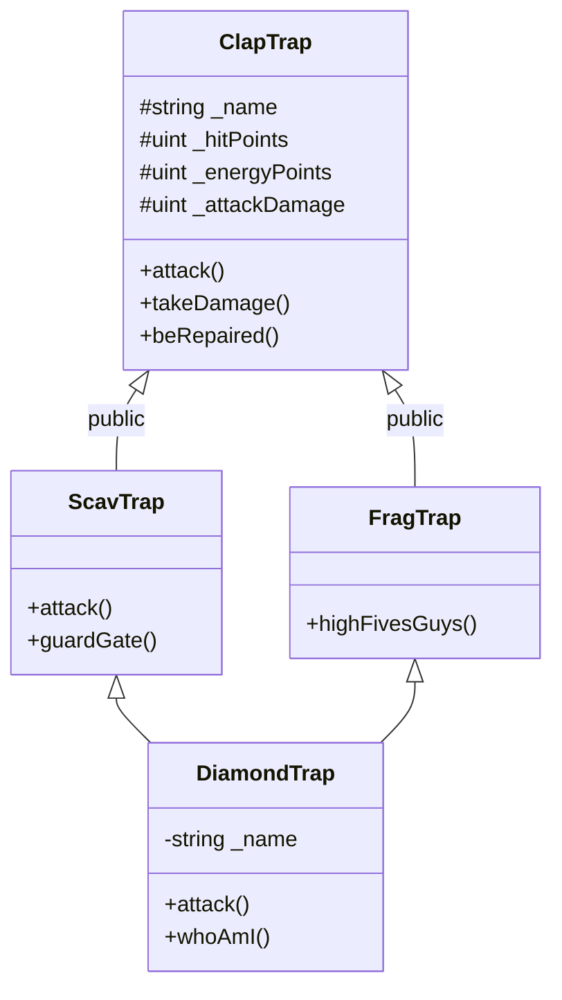

cpp03/
├── ex00/  ClapTrap
├── ex01/  ScavTrap  (inherits ClapTrap)
├── ex02/  FragTrap  (inherits ClapTrap)
└── ex03/  DiamondTrap (ScavTrap + FragTrap, virtual inheritance)
```

---

## Big picture: what this module teaches

| Exercise | Concept |
|----------|---------|
| **ex00** | A class in Orthodox Canonical Form |
| **ex01** | Simple inheritance (`ScavTrap` → `ClapTrap`) |
| **ex02** | Another derived class (`FragTrap`) |
| **ex03** | Multiple inheritance + the **diamond problem** |

---

## Shared rules (every exercise)

- Compile with `c++ -Wall -Wextra -Werror -std=c++98`
- Orthodox Canonical Form: default ctor, copy ctor, `operator=`, destructor
- No `using namespace`, no `friend`, no STL containers
- Headers need include guards; logic stays in `.cpp` files
- Constructor/destructor messages so chaining is visible

---

# Exercise 00 — ClapTrap

### `ClapTrap.hpp` — the blueprint

```cpp
#ifndef CLAPTRAP_HPP
# define CLAPTRAP_HPP
```
**Include guards** — if this header is included twice, the second time is skipped. Without them → redefinition errors → grade 0.

```cpp
# include <string>
```
Needed for `std::string`. Each header must include what it needs.

```cpp
class ClapTrap
{
private:
	std::string		_name;
	unsigned int	_hitPoints;
	unsigned int	_energyPoints;
	unsigned int	_attackDamage;
```
**Private attributes** (ex00 only — later become `protected` so children can use them):

| Attribute | Start value | Meaning |
|-----------|-------------|---------|
| `_name` | from ctor | robot name |
| `_hitPoints` | 10 | health |
| `_energyPoints` | 10 | fuel for attack/repair |
| `_attackDamage` | 0 | damage dealt |

Underscore prefix = “member variable” style (common at 42).

```cpp
public:
	ClapTrap(void);
	ClapTrap(const std::string& name);
	ClapTrap(const ClapTrap& other);
	ClapTrap& operator=(const ClapTrap& other);
	~ClapTrap(void);
```
**Orthodox Canonical Form:**

1. Default constructor — create without args  
2. Param constructor — create with a name  
3. Copy constructor — `ClapTrap b(a);`  
4. Copy assignment — `b = a;`  
5. Destructor — cleanup when object dies  

```cpp
	void	attack(const std::string& target);
	void	takeDamage(unsigned int amount);
	void	beRepaired(unsigned int amount);
```
The three required actions. `const std::string&` avoids copying the string.

---

### `ClapTrap.cpp` — the behavior

**Constructor with initializer list:**
```cpp
ClapTrap::ClapTrap(const std::string& name)
	: _name(name), _hitPoints(10), _energyPoints(10), _attackDamage(0)
{
	std::cout << "ClapTrap constructor called for " << _name << std::endl;
}
```
`: _name(name), ...` initializes members **before** the body runs — preferred over assigning inside `{}`.

**Copy assignment — self-assignment check:**
```cpp
if (this != &other)
{
	_name = other._name;
	// ...
}
return *this;
```
Avoids weird bugs when someone writes `a = a;`. Returns `*this` so chaining works: `a = b = c`.

**`attack`:**
```cpp
if (_hitPoints == 0) { /* refuse */ return; }
if (_energyPoints == 0) { /* refuse */ return; }
_energyPoints--;
std::cout << "ClapTrap " << _name << " attacks " << target
	<< ", causing " << _attackDamage << " points of damage!" << std::endl;
```
Subject rules: need hit points **and** energy; costs 1 energy; print a message.

**`takeDamage`:**
```cpp
if (amount >= _hitPoints)
	_hitPoints = 0;
else
	_hitPoints -= amount;
```
Uses `unsigned int`, so we must not underflow (`0 - big number` wraps around). Cap at 0.

**`beRepaired`:** same energy/HP checks as attack, then `_hitPoints += amount` and spend 1 energy.

---

### Makefile (all exercises share this pattern)

```makefile
NAME		= claptrap
CXX			= c++
CXXFLAGS	= -Wall -Wextra -Werror -std=c++98
SRCS		= main.cpp ClapTrap.cpp
OBJS		= $(SRCS:.cpp=.o)
```
- `NAME` — binary name  
- `CXXFLAGS` — required flags + C++98  
- `OBJS` — turn each `.cpp` into `.o`  

```makefile
$(NAME): $(OBJS)
	$(CXX) $(CXXFLAGS) $(OBJS) -o $(NAME)
```
Link object files into the executable.

```makefile
%.o: %.cpp
	$(CXX) $(CXXFLAGS) -c $< -o $@
```
Pattern rule: compile one `.cpp` → `.o` (`$<` = source, `$@` = target).

`clean` / `fclean` / `re` — remove objs, remove binary, rebuild from scratch.

---

# Exercise 01 — ScavTrap (inheritance)

### Why change `private` → `protected`?

Subject: *“ScavTrap will use the attributes of ClapTrap (update ClapTrap accordingly)”*.

- `private` → only `ClapTrap` can touch them  
- `protected` → `ClapTrap` **and** derived classes can touch them  
- `public` → everyone (too open)

So from ex01 onward, attributes are `protected`.

### `ScavTrap.hpp`

```cpp
class ScavTrap : public ClapTrap
```
**Public inheritance** = “ScavTrap **is a** ClapTrap”. Public/protected members of the parent stay accessible the same way.

```cpp
	void	attack(const std::string& target);
	void	guardGate(void);
```
- `attack` is **redefined** with a ScavTrap message  
- `guardGate` is ScavTrap’s unique ability  

### `ScavTrap.cpp` — construction chaining

```cpp
ScavTrap::ScavTrap(const std::string& name) : ClapTrap(name)
{
	_hitPoints = 100;
	_energyPoints = 50;
	_attackDamage = 20;
	std::cout << "ScavTrap constructor called for " << _name << std::endl;
}
```

What happens:

1. `: ClapTrap(name)` builds the **base** first (prints ClapTrap message, starts with 10/10/0)  
2. Body **overrides** stats to ScavTrap values: **100 HP / 50 EP / 20 AD**  
3. Prints ScavTrap message  

Destruction is the **reverse**: ScavTrap dtor → ClapTrap dtor. Why? Destroy the derived shell first, then the base it sits on — like demolishing the top floor before the foundation.

```cpp
void	ScavTrap::guardGate(void)
{
	std::cout << "ScavTrap " << _name
		<< " is now in Gate keeper mode!" << std::endl;
}
```

---

# Exercise 02 — FragTrap

Same idea as ScavTrap, different numbers and ability:

| | ScavTrap | FragTrap |
|--|----------|----------|
| HP | 100 | 100 |
| EP | 50 | 100 |
| AD | 20 | 30 |
| Special | `guardGate()` | `highFivesGuys()` |
| `attack` | own message | uses ClapTrap’s (subject doesn’t require a custom one) |

```cpp
void	FragTrap::highFivesGuys(void)
{
	std::cout << "FragTrap " << _name
		<< " requests a positive high five!" << std::endl;
}
```

Construction order again: **ClapTrap → FragTrap**, destruction reverse.

---

# Exercise 03 — DiamondTrap (the diamond problem)

### The problem

```
        ClapTrap
        /      \
   ScavTrap   FragTrap
        \      /
       DiamondTrap
```

Without a fix, DiamondTrap would get **two** ClapTrap subobjects (one via each parent). Ambiguous `_name`, double construction — broken.

### The trick: `virtual` inheritance

```cpp
class ScavTrap : virtual public ClapTrap
class FragTrap : virtual public ClapTrap
class DiamondTrap : public ScavTrap, public FragTrap
```

`virtual public` means: “share **one** ClapTrap base.” Only the **most derived** class (`DiamondTrap`) constructs that shared ClapTrap.

### `DiamondTrap`’s own `_name` (shadowing)

```cpp
private:
	std::string	_name;   // same name as ClapTrap::_name on purpose
```

Subject wants both:

- `DiamondTrap::_name` → `"Dia"`  
- `ClapTrap::_name` → `"Dia_clap_name"`  

That is **name shadowing**. `-Wshadow` warns about it; `-Wno-shadow` silences it. That’s why the subject mentions those flags.

### Constructor

```cpp
DiamondTrap::DiamondTrap(const std::string& name)
	: ClapTrap(name + "_clap_name")  // virtual base — built ONCE, by us
	, ScavTrap(name)                 // ClapTrap part of ScavTrap is skipped
	, FragTrap(name)                 // same
	, _name(name)                    // DiamondTrap's own name
{
	_hitPoints = 100;      // from FragTrap
	_energyPoints = 50;    // from ScavTrap
	_attackDamage = 30;    // from FragTrap
	...
}
```

Why set stats in the body? ScavTrap and FragTrap both write the **same** shared HP/EP/AD. Whichever parent runs last would “win,” so DiamondTrap forces the required mix:

| Stat | Source | Value |
|------|--------|-------|
| Hit points | FragTrap | 100 |
| Energy | ScavTrap | 50 |
| Attack damage | FragTrap | 30 |
| `attack()` | ScavTrap | ScavTrap message |

```cpp
void	DiamondTrap::attack(const std::string& target)
{
	ScavTrap::attack(target);  // resolve ambiguity → use ScavTrap's attack
}
```

Without this, `attack` would be ambiguous (ScavTrap has one, FragTrap inherits ClapTrap’s).

```cpp
void	DiamondTrap::whoAmI(void)
{
	std::cout << "DiamondTrap name: " << _name
		<< " | ClapTrap name: " << ClapTrap::_name << std::endl;
}
```
`_name` → Diamond’s name. `ClapTrap::_name` → base name with `_clap_name` suffix.

Construction order you’ll see in tests:

1. ClapTrap (once)  
2. ScavTrap  
3. FragTrap  
4. DiamondTrap  

Destruction: reverse (Diamond → Frag → Scav → Clap).

---

## How inheritance looks as a diagram



---

## How to build & run (on 42 / Linux / WSL)

```bash
cd ex00 && make && ./claptrap
cd ../ex01 && make && ./scavtrap
cd ../ex02 && make && ./fragtrap
cd ../ex03 && make && ./diamondtrap
```

All four already build and run successfully via WSL on your machine.

---

## What to say in peer evaluation

1. **Orthodox Canonical Form** — all four special members, why self-assignment check.  
2. **protected vs private** — children need access to stats.  
3. **Construction/destruction order** — base first, derived last; destroy reverse.  
4. **Diamond problem** — two paths to ClapTrap → duplicate base; fixed with `virtual` inheritance so ClapTrap is created once by DiamondTrap.  
5. **Shadowing** — DiamondTrap and ClapTrap both have `_name`; `whoAmI` prints both; `-Wshadow` related.

If you want, I can go deeper on one exercise only (e.g. walk `DiamondTrap.cpp` statement by statement), or quiz you like a peer eval.

---

**User**

<timestamp>Monday, Aug 3, 2026, 2:45 PM (UTC+4)</timestamp>
<system_notification>
The following task has finished. If you were already aware, ignore this notification and do not restate prior responses.

<task>
kind: shell
status: success
task_id: 193787
title: Build and run all four exercises via WSL
tool_call_id: call-74c880b8-7834-4b96-af72-6bec3c35b0c1-36
fc_f62e7fe3-0bcd-95dd-b8e4-79f0c60952a1_0
output_path: C:\Users\Aaqil\.cursor\projects\d-42-CPP-main-cpp03\terminals\193787.txt
</task>
</system_notification>
<user_query>Briefly inform the user about the task result and perform any follow-up actions (if needed). If there's no follow-ups needed, don't explicitly say that.</user_query>

---

**Cursor**

All four exercises built and ran successfully under WSL (`ex00` → `ex03`, exit code 0 each). The full cpp03 project is ready to use.

